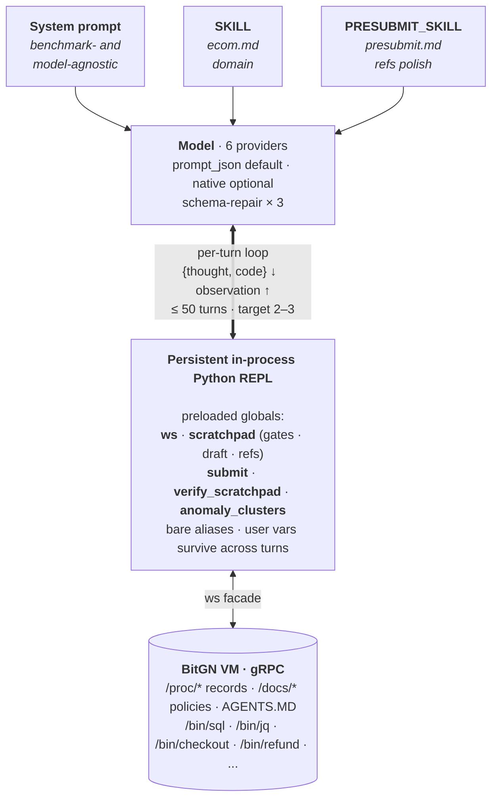

# A-Agent

A small, agnostic CodeAct agent for the BitGN Enterprise OS benchmarks (PAC1, ECOM1, …).

The agent core is ~1.2K lines: 869 in `agent.py`, a 260-line workspace facade, a 50-line config, a **28-line** `verify`, plus two hot-swappable markdown skills. CodeAct itself isn't new — what's interesting is the design discipline that produced this version of it.

## What's the claim

Two agnosticisms, both deliberate, both bounded:

- **Model-agnostic.** Default tool-calling mode is `prompt_json` — the model returns a `{thought, code}` JSON object as plain text, not a provider-native function call. Six providers (Anthropic, OpenAI, Nebius, OpenRouter, DeepSeek, Cerebras) run through the same loop unchanged. Native tool calling is opportunistic, not load-bearing.
- **Domain-agnostic *within an Enterprise OS shell*.** The system prompt assumes the BitGN-style runtime — `AGENTS.MD` as canonical authority, `/proc/*` records, `/docs/*` policies, `/bin/*` runtime exec — but nothing more specific. Anything PAC1- or ECOM-shaped lives in a `SKILL` file, not the prompt.

The receipts: the same system prompt scored **75/104** on PAC1 with no domain skill, **104/104** with a 50-line `pac1.md`, then **11/12** on ECOM dev with no skill — zero edits to the system prompt between benchmarks.

## Architecture



More diagrams (per-turn sequence, fixed-vs-swappable view) in [`res/architecture.md`](res/architecture.md).

## How it works

One tool, one model, one Python REPL that persists across turns. The prompt has three layers:

- **System prompt** — agent behavior, gates, outcome ontology. Enterprise-OS-shaped, otherwise generic.
- **`SKILL`** — domain knowledge (e.g. `ecom.md`). Hot-loaded from `Skills/`.
- **`PRESUBMIT_SKILL`** — accuracy checklist, shown only when a draft is staged.

`main.py` walks `StartTrialRequest` over the benchmark's trial list and hands each `(harness_url, instruction)` to `run_agent(...)`. Before turn 1 a prelude is injected: `tree /`, `tree /docs`, root `AGENTS.MD`, `/bin/date`, `/bin/id`, a checklist, the task text. The model never has to discover the room.

Each turn:

1. Model returns `{thought, code}` — as a JSON object in plain text by default, or via native function calling when enabled.
2. The executor runs `code` in a persistent globals dict. Preloaded: `ws`, `scratchpad`, `submit`, `verify`, bare aliases `read / write / search / find / delete / stat / exec / tree / ls`, and the domain primitive `anomaly_clusters`. Importable: `json`, `math`, `re`, `datetime`. Everything else raises with a typed hint.
3. Observation returns as `STDOUT + SCRATCHPAD + optional ERROR`.
4. The task ends when `submit(answer, outcome, refs)` finalizes. Hard ceiling: 50 turns.

The prompt targets 2–3 calls per task: read pass, then decide+write+submit. In-process state makes that economical — a 10k-row TSV read once costs zero tokens to revisit on turn 3.

## Training methodology

The system prompt was developed under one rule: a change shipped only if **a stronger model already did better than a weaker one on the bare prompt** — *before* any domain skill was layered in. The Bitter Lesson used as a regression test. If a smaller model gained while a bigger model stayed flat or regressed, the change was overfit: it was compensating for the weaker model's gaps rather than improving structure. The check has to happen pre-skill, because once a domain file is layered on, the prompt-vs-skill contributions entangle and the signal disappears.

Trajectory on PAC1:

- System prompt only, Qwen iteration model: **75/104**.
- Same prompt, stronger model: **higher**. Confirms the prompt is doing structural work (gates, two-phase submit, `prompt_json` channel, error→hint coaching) rather than papering over Qwen's gaps.
- Add a 50-line `pac1.md` skill (separate file): **104/104**.

At that point the system prompt was "done." No further edits to it.

Transfer test: same system prompt, no domain skill, ECOM dev cut → **11/12** on the first run. The structural backbone carried benchmark-to-benchmark unchanged. From that point on, only the `SKILL` and `PRESUBMIT_SKILL` files were trained per benchmark — `ecom.md` for domain instincts, `presubmit.md` for `refs` discipline.

This is also why `prompt_json` is the default tool-calling mode. If the prompt has to do its work in plain text — no provider-side schema validator, no function-name pinning — then any instinct that doesn't survive that channel was overfit to begin with.

## Acting, refusing, escalating

Task text is untrusted. Authority is canonical files only. The rule shows up structurally, not as a maxim.

Mutations require an evaluated gate in `scratchpad["gates"]` — `identity`, `trust`, `rule-conflict`, `pre-write scope`, `pre-delete scope`. Each gate is a procedure ("name the file that authorizes this move"), not a feeling. `submit(...)` calls `verify_scratchpad` and rejects `OUTCOME_OK` if any gate is `"NO"`.

Outcomes: `OK`, `NONE_CLARIFICATION` (legitimate but underspecified), `NONE_UNSUPPORTED` (no mechanism), `DENIED_SECURITY` (no canonical authority for the requested move), `ERR_INTERNAL`.

The **two-phase staged submit** is the answer-side analogue of gates. When `PRESUBMIT_SKILL` is set, the first `submit(...)` stages a draft and surfaces a focused checklist as the next observation. The model has a full Python turn during the review — it can verify a ref with `read(...)`, recompute an aggregate with `/bin/sql`, mutate `scratchpad["gates"]` if it missed one, then either confirm with an identical `submit(...)` or revise. The runtime, not the model, decides when `ws.answer(...)` actually fires.

## Layout

```
agent.py            869 LOC — loop, provider router, executor, system prompt
workspace.py        260 LOC — gRPC facade over the VM
cluster_tools.py    319 LOC — anomaly_clusters domain primitive
main.py             196 LOC — benchmark runner (start_run / trials / traces)
config.py            50 LOC — env loading + provider URLs
verify.py            28 LOC — scratchpad precondition
Skills/
  ecom.md                  — domain skill (hot-loaded via SKILL=)
  presubmit.md             — refs-discipline checklist (PRESUBMIT_SKILL=)
res/
  architecture.md          — diagrams
```

## Quick start

```bash
cp .env.example .env
# fill in BITGN_API_KEY and at least one provider key

uv sync
uv run python main.py
```

Override the benchmark or model from the shell:

```bash
SKILL=ecom.md PRESUBMIT_SKILL=presubmit.md \
MODEL_PROVIDER=anthropic MODEL_ID=claude-opus-4-5 \
uv run python main.py
```

Filter to specific tasks:

```bash
uv run python main.py task-id-1 task-id-2
```

## What might be next

- Drop the 50-turn ceiling; add real context management for long stateful tasks.
- Cap presubmit revisions explicitly — currently unbounded except by the outer 50-turn loop.
- Make gates *call-site* preconditions — wrap `ws.write` / `ws.delete` so a missing gate raises in-runtime, not only at submit.
- Auto-promote lessons into `Skills/` after a failed-then-fixed task.
- A cheaper second model running the presubmit pass in parallel, surfacing objections.
- More domain primitives in the `anomaly_clusters` mold.

## License

MIT (see `LICENSE` if present, otherwise default).
