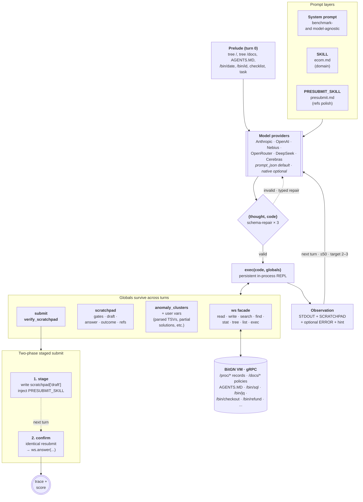

# A-Agent

**1st place** at the [BitGN Agentic E-Commerce Challenge](https://bitgn.com/l/ecom1-accuracy) — **81.3 / 100** with OpenAI GPT-5.5, **68.1 / 100** with Qwen3.5-397B-A17B (Nebius), on the blind accuracy leaderboard.

The challenge: BitGN's E-commerce challenge, featuring COLIBRIX ONE as lead partner, is a benchmark for agentic commerce — a simulated environment where AI agents handle the full customer journey (discovery, checkout, payment failures, fraud, returns, support) under business constraints. The goal is to test whether an agent can act safely before similar systems touch live commerce infrastructure.

Note: this repo is intentionally small — ~1.2K LOC of agent core plus two hot-loaded markdown skills. CodeAct (code as a tool) itself isn't new; the training discipline that produced this version of it is the point. First you train the workspace, then the domain skill.

The system prompt (the version used during the blind window) lives in `agent.py`. Domain knowledge in `Skills/ecom.md`. Answer-review checklist in `Skills/presubmit.md`.

## Setup

Prerequisites: Python 3.x via [`uv`](https://docs.astral.sh/uv/).

```bash
uv sync
cp .env.example .env
```

Fill in `.env`:

```
BITGN_API_KEY=<your-bitgn-key>
OPENAI_API_KEY=<your-openai-key>     # or any one provider key
MODEL_PROVIDER=openai
MODEL_ID=gpt-5.5
SKILL=ecom.md
PRESUBMIT_SKILL=presubmit.md
```

Run:

```bash
uv run python main.py
```

Filter to specific tasks: `uv run python main.py <task-id> ...`. Full env reference in `.env.example`.

## Architecture

One agent, one tool, one Python REPL that persists across turns. Three prompt layers, all hot-swappable.



- **System prompt** (in `agent.py`) — agent behavior, gates, outcome ontology. Benchmark- and model-agnostic.
- **`SKILL`** and **`PRESUBMIT_SKILL`** — domain knowledge and answer-review checklist; hot-loaded markdown from `Skills/` via env vars.
- **Single tool: `execute_python`** — every action is Python. The model returns `{thought, code}`; variables persist across turns; it builds on its own previous code instead of re-reading.
- **Workspace facade (`workspace.py`)** — thin Connect-RPC wrapper. Exposes `ws.read/write/search/find/exec/list/stat/tree` plus runtime tools (`/bin/sql`, `/bin/jq`, `/bin/checkout`, `/bin/refund`, …) through `ws.exec(...)`.
- **Scratchpad** — JSON dict surviving across `execute_python` calls. Holds gates, draft, answer, outcome, refs.
- **Gates** — `identity`, `trust`, `rule-conflict`, `pre-write scope`, `pre-delete scope`. Set `"YES"` / `"NO"` / `"BLOCKED"`. `verify_scratchpad` (28 lines, in `verify.py`) blocks `OUTCOME_OK` if any gate is `"NO"`.
- **Two-phase staged submit** — first `submit(...)` stages the answer and injects the presubmit checklist as the next observation. The model gets a full Python turn to verify, recompute, or revise before an identical second `submit(...)` finalizes `ws.answer(...)`.
- **Any model** — Anthropic, OpenAI, Nebius, OpenRouter, DeepSeek, Cerebras. Native function calling is flaking, so best use is`prompt_json` (JSON-in-text), selected per run.
- **Domain tools** — just one, `cluster_tools.anomaly_clusters(ws, ...)` ships the SQL + haversine + implied-speed logic for fraud tasks as code, so the model decides verdicts instead of rewriting math.

Target call structure: 2–3 `execute_python` calls per task — call 1 batches reads, call 2 decides + writes + submits, call 3 recovers if needed.

## What is different

The hypothesis was to separate workspace training and domain training. Agent supposed to be universal at the core.

### The system prompt is the constant; everything else is swappable

SAME system prompt (just toolset changed a bit) scored **75/104** on PAC1 with no skill, **104/104** with a 50-line `pac1.md`, then **11/12** on the first ECOM dev cut with no skill again.  
Domain skills live in separate markdown; the system prompt only carries the Enterprise OS shell — `AGENTS.MD` as authority, `/proc + /docs` shape, `/bin/*` runtime. 

### Bitter Lesson as a regression test

A change shipped only if a *stronger* model already did better than a weaker one on the bare prompt — before any domain skill. If a smaller model gained while a bigger model regressed, the change was overfit to the smaller model's weaknesses, not to the structure. The leaderboard gap (Qwen 68.1 → GPT-5.5 81.3 on the same agent) is the same check measured on the blind set. I have overengeered my agent on duruing PAC1, so that's lesson learned for me too.

### Two-phase staged submit

Added most of ECOM scores. A presubmit checklist injected as an observation, with a full Python turn to verify or revise before the identical second `submit(...)` actually fires `ws.answer(...)`. 

### Domain tools

For fraud-style work, `anomaly_clusters(ws, ...)` ships the SQL, haversine, and implied-speed logic as code. The model decides verdicts. 

Precise grounding was the main source of errors, so it probably required separate appoach but I did not finish it before main event.
