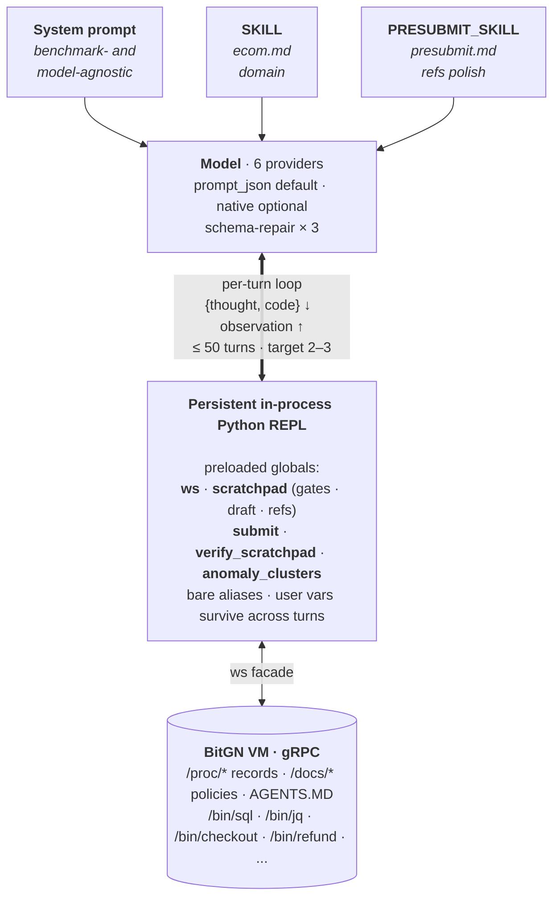
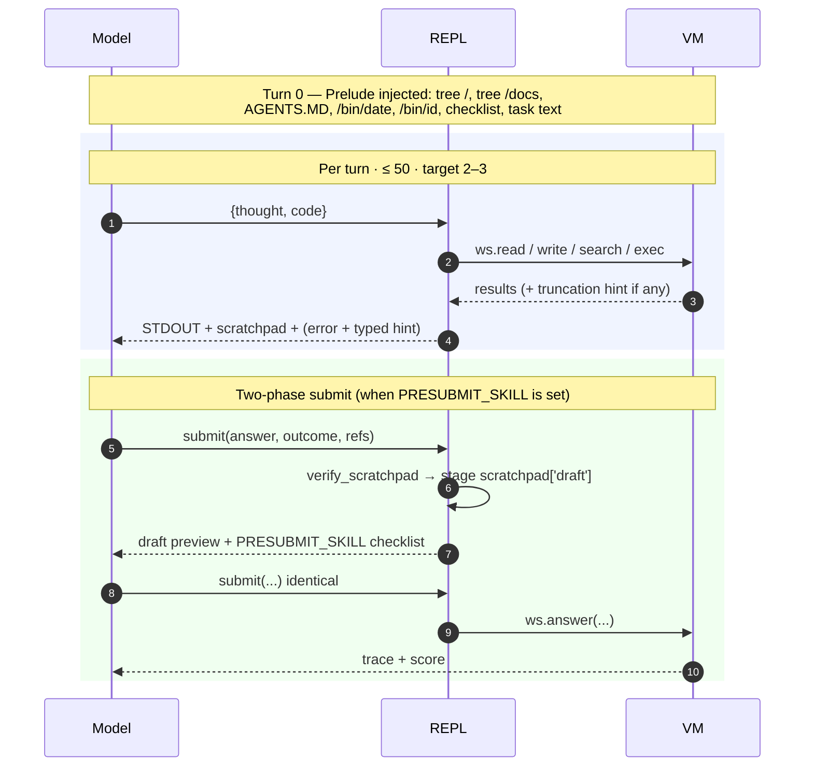
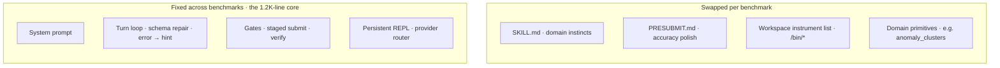

# A-Agent — architecture diagrams

Two views: a static layout (what the parts are) and a sequence (what happens during a task).

## 1. Architecture

Three prompt layers fan into the model. The model and the REPL talk every turn. The REPL is the only thing that talks to the VM.

## 2. Lifecycle

Time goes down. The two coloured blocks separate the normal turn loop from the staged-submit phase.

## 3. Seams — fixed vs swappable per benchmark

